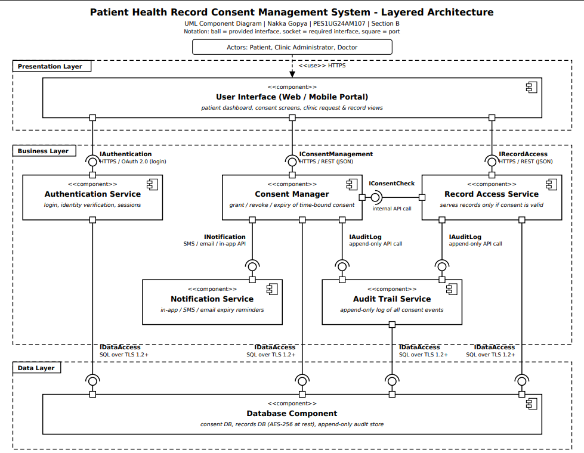

# Patient Health Record Consent Management System

## Project Information

| Field | Details |
|---|---|
| **System** | Patient Health Record Consent Management System |
| **Problem Statement** | #13 |
| **Architecture** | Layered Architecture |
| **Name** | Nakka Gopya |
| **SRN** | PES1UG24AM107 |
| **Section** | B |

---

## UML Component Diagram

This repository contains the **UML Component Diagram** for the Patient Health Record Consent Management System.

The system follows a **Layered Architecture** consisting of three layers: Presentation, Business, and Data.



---

## Repository Contents

```text
Lab3/
│
├── Lab3_Component_Diagram.png
├── Lab3_Justification.pdf
└── README.md
```

### `Lab3_Component_Diagram.png`

UML Component Diagram showing the layered architecture, system components, interfaces, and their relationships.

### `Lab3_Justification.pdf`

Contains the architecture selection and justification for choosing the Layered Architecture.

### `README.md`

Provides an overview of the architecture, components, interfaces, security, performance considerations, and architectural trade-offs.

---

## Architecture

The system is organized into three horizontal layers.

### 1. Presentation Layer

The Presentation Layer contains the:

**User Interface (Web / Mobile Portal)**

It provides:

- Patient dashboard
- Consent screens
- Clinic request and record views

### 2. Business Layer

The Business Layer contains the main application services:

- **Authentication Service** – Handles login, identity verification, and sessions.
- **Consent Manager** – Handles granting, revocation, and time-bound consent expiry.
- **Record Access Service** – Provides records only when valid consent exists.
- **Notification Service** – Provides in-app, SMS, and email expiry reminders.
- **Audit Trail Service** – Maintains an append-only log of consent events.

The **Record Access Service** calls the **Consent Manager** through `IConsentCheck` before returning a health record. This provides a single enforcement point for consent rules.

### 3. Data Layer

The Data Layer contains the:

**Database Component**

It stores:

- Consent database
- Patient records database
- Append-only audit store

Only the Data Layer directly accesses the database.

---

## Interfaces

The components communicate through the following interfaces:

| Interface | Purpose |
|---|---|
| `IAuthentication` | User authentication and identity verification |
| `IConsentManagement` | Granting, revoking, and managing consent |
| `IRecordAccess` | Accessing patient health records |
| `IConsentCheck` | Checking whether consent is valid |
| `INotification` | Sending consent-related notifications |
| `IAuditLog` | Recording consent and record-access events |
| `IDataAccess` | Communication with the database |

---

## Security

The architecture provides the following security measures:

- The User Interface has no direct database access.
- Every record access passes through the Record Access Service.
- Consent is checked before a record is returned.
- Consent events are recorded in an append-only audit trail.
- Records are encrypted using **AES-256 at rest**.
- Communication uses **TLS 1.2+** in transit.
- The audit store can use an insert-only database account to support a tamper-evident log.

---

## Performance

The layered design allows calls between layers to be performed in-process, avoiding unnecessary network hops between internal services.

The Business Layer can also:

- Cache consent decisions.
- Cache expiry timestamps with a short TTL.
- Invalidate cached consent information when consent is revoked.
- Use database indexes on timestamps for audit-trail filtering.

---

## Why Layered Architecture?

Layered Architecture was selected because it provides a **single enforcement point for consent rules** and maintains **strong consistency with low operational complexity**.

The system uses one transactional database, allowing consent state and audit entries to remain consistent. The architecture also avoids the additional network hops and distributed-data consistency issues associated with a microservices approach for this system.

---

## Trade-off

A Layered Architecture can be harder to scale individual components independently and may introduce tighter coupling between layers.

For this system, the complete stack can be scaled horizontally behind a load balancer, while the defined interfaces keep the components replaceable.
